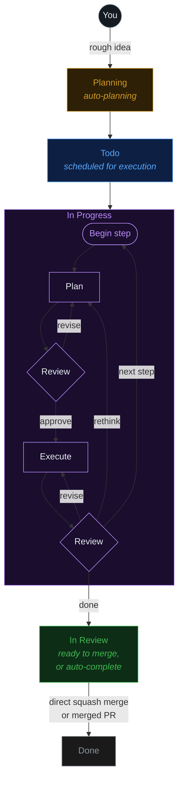

<div align="center">


# Fusion

### From rough idea to production code — automatically.

**Multi-node agent orchestrator** — tasks, agents, missions, git, files, and worktrees, with any model, local or cloud.

[**runfusion.ai →**](https://runfusion.ai) · [Docs](./docs/README.md) · [GitHub](https://github.com/Runfusion/Fusion) · [npm](https://www.npmjs.com/package/@runfusion/fusion) · [Discord](https://discord.gg/ksrfuy7WYR)

[](./LICENSE)
[](https://www.npmjs.com/package/@runfusion/fusion)
[](https://discord.gg/ksrfuy7WYR)


<br />


<br />
<br />

<a href="https://runfusion.ai">
  
</a>

</div>

---

## Your entire dev environment. On a single pane of glass.

Describe a task in plain language. A planning agent reads your project, understands context, and writes a full `PROMPT.md` plan — steps, file scope, acceptance criteria. Then Fusion plans, reviews, executes, and reviews again, in an isolated git worktree, with a human approval gate wherever you want one.

One board. Controlled from anywhere. Laptop, Mac mini, Linux server, cloud VM, phone — all connected.

> Like Trello, but your tasks get specified, executed, and delivered by AI. Built on the great work of [dustinbyrne/kb](https://github.com/dustinbyrne/kb).

---

## The flow

```
  ①  Describe          ②  Planning             ③  The board           ④  Isolated worktree
  ─────────────        ─────────────         ─────────────          ─────────────────────
  "Add dark mode   →   Agent writes    →   Plan → Review →    →   fusion/FN-123 branch
   toggle to           PROMPT.md           Execute → Review        concurrent, zero
   settings panel"     (steps, scope,      (per step, until        file conflicts
                       acceptance)         done)
```

### See every step, before the merge

<div align="center">
  
</div>

Every task shows its plan, its reviews, its diffs, and its file changes in real time. Jump into an active task and nudge direction, tighten constraints, pause, or re-prompt.

---

## What makes it different

|  |  |
|---|---|
| 🧠 **AI planning** | Describe a task in plain language. Planning agents turn it into a `PROMPT.md` plan with steps, file scope, and acceptance criteria. |
| 🔁 **Workflow gates** | Plan → Review → Execute → Review on every step. Pre-merge gates block bad code; post-merge gates run informational checks. |
| 🌳 **Worktree isolation** | Each task runs in its own branch and worktree (`fusion/{task-id}`). Parallel tasks. Zero conflicts. |
| ⚡ **Smart merge** | Passing every gate? Fusion squash-merges and moves on. Opt into manual approval anywhere. |
| 🛰️ **Multi-node mesh** | Laptop, Mac mini, Linux server, cloud VM, phone — all synced. Desktop, mobile, web. |
| 🧩 **Any model** | Anthropic, OpenAI, Ollama, and more. Local and cloud coexist. |
| 🏢 **Agent companies** | Import pre-built teams — 440+ agents across 16 companies — and run them autonomously for weeks. |
| 📬 **Inter-agent messaging** | Built-in mailbox between agents. Delegate, clarify, coordinate. |
| 🗺️ **Missions** | Hierarchical planning (Mission → Milestone → Slice → Feature → Task) with autopilot and validation contracts. |
| 🔬 **Research** | Bounded research runs with web search, GitHub, local docs, and LLM synthesis. Turn findings into tasks. ([Docs](./docs/research.md)) |
| 🧪 **Self-improvement** | Agents reflect on their own output and update their prompts as they learn your codebase. |
| 🔓 **Open source. MIT.** | No vendor lock-in. Run it on your own hardware. Shipping weekly. |

---

## How it works



Tasks with dependencies are processed sequentially. Independent tasks run in parallel. Optionally require manual approval before tasks move from Planning to Todo (`requirePlanApproval` setting).

---

## Multi-node. One board. Every platform.

<div align="center">


<br />


</div>

Laptop, Mac mini, Linux server, cloud VM, phone — every node is a peer. Your task state, agents, logs, and diffs stay synchronized across the mesh. The same Fusion ships as:

- 🖥️ **Desktop app** — Electron for **macOS** (Intel + Apple Silicon), **Windows** 10/11, and **Linux**
- 📱 **Mobile app** — Capacitor for **iOS/iPadOS** and **Android** ([MOBILE.md](./MOBILE.md))
- 🌐 **Web dashboard** — any modern browser, served from the `fn dashboard` daemon
- 🔌 **CLI** — `fn` binary + extension for terminal-first workflows

Start the daemon on any node, connect your other devices, and the board follows you everywhere.

---

## Run an agent company

<div align="center">


</div>

Import a team. Run it autonomously for weeks. **440+ agents across 16 companies**, wired for missions, mailboxes, and inter-agent delegation.

```bash
npx companies.sh add paperclipai/companies/gstack
```

---

## Compatible with the tools you already use.

Fusion integrates with the tools you love. **Hermes**, **Paperclip**, and **OpenClaw** all ship as first-class plugins — route any workspace to whichever runtime fits the task. And any Paperclip agent-company imports with a single command.

<div align="center">
  
</div>

### [Hermes](https://hermes-agent.nousresearch.com) <sub>`experimental`</sub>

<sub>Nous Research</sub>

The open-source autonomous agent from **Nous Research**. Install the Hermes plugin and run agents through Hermes for long-running, context-growing work — route any Fusion workspace to it.

### OpenClaw <sub>`experimental`</sub>

OpenClaw runtime support is available as an experimental plugin (`fusion-plugin-openclaw-runtime`) for runtime discovery/configuration parity. Configure agents with `runtimeConfig.runtimeHint: "openclaw"` after installing the plugin.

<br />

<div align="center">
  
</div>

### [Paperclip](https://paperclip.ing) <sub>`experimental`</sub>

<sub>paperclip.ing</sub>

The human control plane for AI labor. Install the Paperclip plugin to run agents through Paperclip inside Fusion.

Fusion also natively supports the **[`companies.sh`](https://github.com/paperclipai/companies)** agent-company standard: import a prebuilt team — **440+ agents across 16 companies** — and let them coordinate over Fusion's mailbox, missions, and workflow gates for weeks of autonomous work. Same company format, same agents, same skills as Paperclip.

```bash
npx companies.sh add paperclipai/companies/gstack
```

<br />

> **Hermes**, **Paperclip**, and **OpenClaw** are **experimental** runtime plugins — APIs and wire formats may shift between minor releases.

---

## Quick start

**Zero install, straight from npm:**

```bash
npx runfusion.ai
```

That launches the dashboard. Subcommands forward through: `npx runfusion.ai task create "fix X"`, `npx runfusion.ai --help`, etc. (Or verbosely: `npx @runfusion/fusion dashboard`.)

**One-line installer** (macOS & Linux — auto-picks Homebrew, falls back to npm):

```bash
curl -fsSL https://runfusion.ai/install.sh | sh
fusion dashboard
```

**Homebrew** (macOS & Linux):

```bash
brew tap runfusion/fusion
brew install fusion
fusion dashboard            # or: fn dashboard
```

Or as a one-liner (auto-taps): `brew install runfusion/fusion/fusion`.

**npm global**:

```bash
npm install -g @runfusion/fusion
fn dashboard                # or: fusion dashboard
```

**From a clone** (for development):

```bash
pnpm dev dashboard
```

Then click the `Open:` URL printed in the terminal. It embeds a bearer token
(`http://localhost:4040/?token=fn_...`) that the browser captures to
`localStorage` on first visit and reuses automatically thereafter. On the
server side, Fusion now persists the dashboard/daemon token in
`~/.fusion/settings.json` on first authenticated run and reuses it on later
starts unless you override it (`--token`, `FUSION_DASHBOARD_TOKEN`,
`FUSION_DAEMON_TOKEN`) or disable auth with `--no-auth`. See
[CLI reference → fn dashboard → Authentication](./docs/cli-reference.md#fn-dashboard)
for full precedence and reset/revocation options.

### First-run setup

On first launch, Fusion opens the **onboarding wizard** with three guided steps:

1. **AI Setup** — Use a simplified quick-start provider list (recommended providers plus any already-connected providers), then expand **Advanced provider settings** only if you need additional providers or setup details. You only need one provider to get started. Deprecated Google Gemini CLI / Antigravity provider entries are intentionally hidden; Google/Gemini API key, Google Generative AI, Vertex, and Cloud Code paths remain supported.
2. **GitHub (Optional)** — Connect GitHub for issue import and PR management
3. **First Task** — Create your first task or import from GitHub (if no project is active, onboarding first prompts you to register/select a project directory)

The wizard is **dismissible and non-blocking** — click **Skip for now** to use the dashboard immediately. Re-trigger it later from **Settings → Authentication → Reopen onboarding guide**.

### Mobile

For Capacitor + PWA workflow, see [MOBILE.md](./MOBILE.md).

---

## Documentation

| Guide | What it covers |
|---|---|
| [Getting Started](./docs/getting-started.md) | Installation and onboarding |
| [Dashboard Guide](./docs/dashboard-guide.md) | Board/list views, terminal, git manager |
| [Task Management](./docs/task-management.md) | Task lifecycle and CLI commands |
| [Settings Reference](./docs/settings-reference.md) | Configuration options |
| [Architecture](./docs/architecture.md) | System internals |
| [Agents](./docs/agents.md) | Agent management, spawning, heartbeat |
| [Workflow Steps](./docs/workflow-steps.md) | Quality gates, templates, phases |
| [Missions](./docs/missions.md) | Mission hierarchy, planning, autopilot |
| [Multi-Project](./docs/multi-project.md) | Central registry, isolation modes |
| [Docker](./docs/docker.md) | Container deployment |

---

## Core features

- **AI Planning** — Planning agent generates detailed `PROMPT.md` with steps, file scope, and acceptance criteria
- **Step-by-step Execution** — Plan → Review → Execute → Review cycle for each task step
- **Git Worktree Isolation** — Each task runs in its own worktree (`fusion/{task-id}` branch)
- **Workflow Steps** — Configurable quality gates (pre-merge: blocks merge; post-merge: informational)
- **GitHub Integration** — Import issues, create PRs, real-time PR/issue badges
- **Dashboard** — Real-time kanban board, agent management, terminal, git manager, mission planner
- **Missions** — Hierarchical planning (Mission → Milestone → Slice → Feature → Task) with autopilot, validation contracts, fix-feature retries, and blocked-handoff semantics
- **Multi-Project** — Manage multiple projects from a single installation with project isolation
- **Inter-Agent Messaging** — Built-in messaging for coordination between agents and users

### Provider authentication

Fusion supports OAuth-based authentication for AI providers configured via **Settings → Authentication**. When the dashboard is accessed via a non-localhost host (remote node, LAN host/IP, or reverse proxy), provider login URLs are automatically rewritten to route OAuth callbacks through a bridge endpoint (`/api/auth/openai-codex/callback`), ensuring the redirect reaches the active browser session.

- **OpenAI Codex** — Authenticates via Settings OAuth flow with secure state validation
- **Factory AI — via Droid CLI** *(optional)* — requires local `droid` install + `droid auth login`, then enable the provider in **Settings → Authentication** and restart Fusion
- **Other providers** — Authenticate via API key entry in Settings (including Google/Gemini API key, Google Generative AI, Vertex, and Cloud Code aliases)
- **Anthropic** — Authenticate via `ANTHROPIC_API_KEY` environment variable

### Model system

Fusion uses a dual-scope model hierarchy with five independent lanes. Global settings define baseline defaults; project settings provide per-project overrides.

| Lane | Purpose | Global Baseline Keys | Project Override Keys |
|------|---------|---------------------|----------------------|
| Executor | Task execution agent | `executionGlobalProvider` + `executionGlobalModelId` | `executionProvider` + `executionModelId` |
| Planning | Task planning agent | `planningGlobalProvider` + `planningGlobalModelId` | `planningProvider` + `planningModelId` |
| Validator | Plan/code reviewer | `validatorGlobalProvider` + `validatorGlobalModelId` | `validatorProvider` + `validatorModelId` |
| Title Summarization | Auto-title generation | `titleSummarizerGlobalProvider` + `titleSummarizerGlobalModelId` | `titleSummarizerProvider` + `titleSummarizerModelId` |
| Workflow Step Refinement | AI prompt refinement | (uses `defaultProvider`/`defaultModelId`) | (uses `modelProvider`/`modelId` on WorkflowStep) |

**Per-Task Overrides:** Tasks can override the executor, validator, and planning lanes with per-task model fields (`modelProvider`/`modelId`, `validatorModelProvider`/`validatorModelId`, `planningModelProvider`/`planningModelId`).

**Precedence:** Per-task → Project override → Global lane → `defaultProvider`/`defaultModelId` → Automatic resolution.

For full settings documentation, see [Settings Reference](./docs/settings-reference.md).

### Scheduled tasks / automations

Fusion supports scheduled task automation via the `/api/automations` endpoints. Automations can run shell commands or multi-step workflows on a configurable schedule.

#### Scheduling scope

Automations and routines can run in two scopes:

- **Global** — Runs across all projects. Use this for cross-project maintenance, backups, or unified reporting.
- **Project** — Runs only within a specific project. Use this for project-specific CI, testing, or deployment tasks.

When you create a schedule without choosing a scope, Fusion defaults to **project scope** with the `default` project ID for backward compatibility.

To explicitly target a scope:
- In the dashboard **Scheduled Tasks** modal, use the **Global / Project** toggle.
- Via the API, pass `?scope=global` or `?scope=project&projectId=<id>` on automation/routine endpoints.

**Scope resolution rules:**
- `scope=global` always resolves to the global automation/routine lane, independent of the active project.
- `scope=project` requires a `projectId`. If omitted, it falls back to `"default"`.
- CRUD, run, toggle, and webhook operations are strictly scope-isolated: a global schedule cannot be mutated from a project-scoped request, and vice versa.

**Operational guidance for multi-project setups:**
- Prefer **global** schedules for shared infrastructure (e.g., nightly backups, memory insight extraction).
- Prefer **project** schedules for per-repository automation (e.g., per-project test runners, deployment hooks).
- Global and project lanes are polled independently by the engine, so due runs in one lane do not block the other.

#### Automations

| Endpoint | Method | Description |
|---------|--------|-------------|
| `/api/automations` | GET | List all automations (filtered by scope if specified) |
| `/api/automations` | POST | Create automation (scope defaults to `project`) |
| `/api/automations/:id` | GET | Get automation by ID |
| `/api/automations/:id` | PATCH | Update automation |
| `/api/automations/:id` | DELETE | Delete automation |
| `/api/automations/:id/run` | POST | Trigger manual run |
| `/api/automations/:id/toggle` | POST | Toggle enabled/disabled |
| `/api/automations/:id/steps/reorder` | POST | Reorder automation steps |

#### Routines

Routines are AI agent tasks triggered by cron schedules, webhooks, or manual execution. Routines share the same global/project scope model as automations.

| Endpoint | Method | Description |
|---------|--------|-------------|
| `/api/routines` | GET | List all routines (filtered by scope if specified) |
| `/api/routines` | POST | Create routine (scope defaults to `project`) |
| `/api/routines/:id` | GET | Get routine by ID |
| `/api/routines/:id` | PATCH | Update routine |
| `/api/routines/:id` | DELETE | Delete routine |
| `/api/routines/:id/run` | POST | Manual trigger |
| `/api/routines/:id/trigger` | POST | Canonical manual trigger |
| `/api/routines/:id/runs` | GET | Get execution history |
| `/api/routines/:id/webhook` | POST | Webhook trigger (signature verification supported) |

---

## CLI quick examples

```bash
fn task create "Fix the login bug"                    # Quick entry → planning
fn task plan "Build auth system"                      # AI-guided planning
fn task import owner/repo --labels bug                # Import GitHub issues
fn task show FN-001                                   # View task details
fn task logs FN-001 --follow                          # Stream execution logs
fn task steer FN-001 "Use TypeScript"                 # Guide the agent mid-execution

fn project add my-app /path/to/app                    # Register a project
fn project list                                       # List all projects

fn settings set maxConcurrent 4                       # Configure settings
fn settings export                                    # Export configuration

fn mission create "Auth System" "Build auth"          # Create mission
fn mission activate-slice <slice-id>                  # Activate a slice

fn skills search react                                # Search skills.sh
fn skills install firebase/agent-skills               # Install agent skills
```

---

## Packages

| Package | Description |
|---------|-------------|
| `@fusion/core` | Domain model — tasks, board columns, SQLite store |
| `@fusion/dashboard` | Web UI — Express server + kanban board with SSE |
| `@fusion/engine` | AI engine — planning, execution, scheduling, workflow steps |
| `@runfusion/fusion` | CLI + extension — published to npm |

---

## Development

```bash
pnpm install                  # Install dependencies
pnpm build                    # Build default workspace packages (excludes desktop/mobile)
pnpm build:all                # Build all packages (including desktop/mobile)
pnpm dev dashboard            # Run dashboard + AI engine
pnpm dev:ui                   # Dashboard only (no AI engine)
pnpm lint                     # Lint all packages
pnpm typecheck                # Type-check all packages
pnpm test                     # Run all tests
```

### Build a standalone executable

Build a single self-contained `fn` binary using [Bun](https://bun.sh/):

```bash
pnpm build:exe                # Build for current platform
pnpm build:exe:all            # Cross-compile for all platforms
```

---

## License

MIT — open source, no vendor lock-in. See [LICENSE](./LICENSE).

<div align="center">

**[runfusion.ai →](https://runfusion.ai)**

</div>
